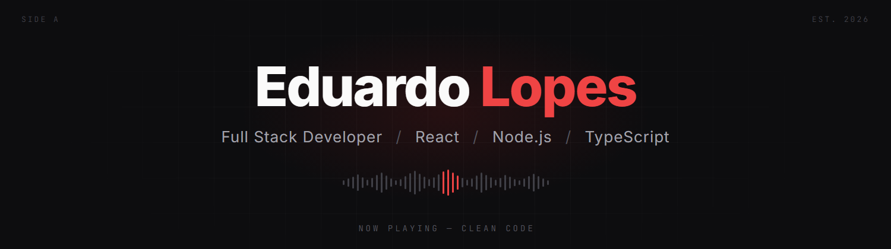

<p align="center">
  
</p>

<p align="center">
  <a href="https://www.linkedin.com/in/eduardo-lopesdev" target="_blank"></a>
</p>

<div align="center">

```text
▂▂▃▅▆▇█▇▆▅▃▂▂▃▄▅▆▇█▆▅▄▃▂▁▂▃▅▇██▇▅▃▂▁▂▄▆█▆▄▂
```

</div>

##  Sobre mim

Sou um **desenvolvedor Full Stack** em formação, com foco em aplicações web utilizando **JavaScript, TypeScript, React e Node.js**. Possuo uma sólida base prática desenvolvida através de uma formação de **mais de 200 horas de foco em programação**, com ênfase na construção de interfaces responsivas, consumo de APIs e estruturação de rotas.

Tenho vivência no desenvolvimento de projetos colaborativos utilizando **Git e GitHub**, aplicando conceitos fundamentais de engenharia de software e metodologias ágeis. Prezo muito pela escrita de **código limpo, legível e de fácil manutenção**. Além disso, possuo afinidade com ***debugging***, identificando erros em códigos e arquitetando a melhor solução técnica.

---

## 🎧 Setlist — Minhas Skills

| # | Faixa | Álbum | Volume |
|:-:|---|:-:|:-:|
| 01 |  **JavaScript** | Core Stack | `█████████░` 90% |
| 02 |  **TypeScript** | Core Stack | `████████░░` 85% |
| 03 |  **React** | Front-End | `████████░░` 85% |
| 04 |  **Node.js** | Back-End | `███████░░░` 75% |
| 05 |  **HTML5** | Front-End | `█████████░` 90% |
| 06 |  **CSS3** | Front-End | `████████░░` 85% |
| 07 |  **MySQL** | Banco de Dados | `██████░░░░` 70% |
| 08 |  **Git & GitHub** | Ferramentas | `████████░░` 85% |

---

##  Github Stats

<p align="center">
  
</p>
